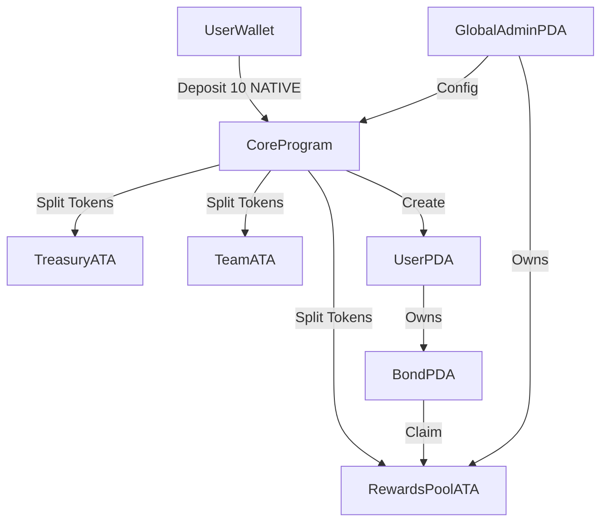

# Testudo Bonds Protocol Onchain Architecture

## Overview

This document outlines the Solana onchain architecture for a sustainable bond-based rewards system. Core mechanics: Users deposit 10 NATIVE tokens to mint a bond (NFT-like PDA), which emits decaying rewards up to 20 tokens over 365 days. Deposits split: 40% rewards pool, 40% treasury, 20% team. Bonds "die" after cap or time limit. Built with native Solana programs using Shank for IDL generation.

### Key Principles

- **PDAs**: Used for deterministic, cheap accounts (seeded by pubkeys/strings).
- **Token Standard**: SPL for NATIVE (minted with fixed 1M supply, decimals=9 for precision).
- **Security**: Only wallet owners can claim; admin PDA for config updates (later DAO).
- **Computations**: On-the-fly reward calcs to minimize storage costs.
- **Events**: Emit for all key actions (deposit, claim, death) for off-chain tracking.

### Accounts & PDAs

1. **Native Token Mint**
   - Type: SPL Mint Account.
   - Authority: Set externally (not managed by this program).
   - Supply: 1,000,000 (fixed; 20% bootstrapped to rewards pool).
   - Decimals: 9.

2. **Global Admin PDA**
   - Seeds: ["global_admin", program_id].
   - Data:
     - `authority: Pubkey` - Admin pubkey (initially deployer's wallet; upgradable to multisig/DAO).
     - `treasury: Pubkey` - Treasury token account address.
     - `team: Pubkey` - Team token account address.
     - `rewards_pool: Pubkey` - Rewards pool token account address.
     - `native_token_mint: Pubkey` - The native token mint address.
     - `daily_emission_rate: u64` - Daily emission rate in lamports (e.g., 55_000_000 for 0.055 tokens).
     - `max_emission_per_bond: u64` - Maximum tokens per bond (20_000_000_000 for 20 tokens).
     - `max_bonds_per_wallet: u8` - Maximum bonds per wallet (default: 10).
     - `token_deposit_split: [u16; 3]` - Split in basis points [rewards_pool, treasury, team].
     - `claim_penalty: u16` - Early claim penalty in basis points (e.g., 500 = 5%).
   - Purpose: Central configurable params; admin can update.

3. **User Account PDA** (One per wallet)
   - Seeds: ["user", wallet_pubkey, program_id].
   - Data:
     - `user: Pubkey` - Wallet pubkey of the user.
     - `bond_count: u8` - Number of active bonds the user currently has.
     - `total_accrued_rewards: u64` - Total rewards accrued across all bonds (9 decimals).
     - `active_bonds: Vec<(u8, Pubkey)>` - Vector of (bond_index, bond_pda) tuples for active bonds.
     - `bond_index: u8` - Index for the next bond to be created (increments per bond).
   - Purpose: Aggregates user state; created on first deposit.

4. **Bond PDA** (One per bond)
   - Seeds: ["bond", user_pda, bond_index (u8), program_id].
   - Data:
     - `owner: Pubkey` - User PDA pubkey that owns this bond.
     - `bond_index: u8` - Index of this bond for the user.
     - `creation_timestamp: i64` - Unix timestamp when bond was created.
     - `last_claim_timestamp: i64` - Last time rewards were claimed.
     - `total_claimed: u64` - Total amount claimed from this bond (in lamports).
     - `is_active: bool` - Whether the bond is active and can be claimed.
   - Purpose: Tracks individual bond state. On claim: Compute decay-based accrual since last_claim, add to total_claimed, transfer from rewards vault if active.

5. **Token Accounts** (SPL Token Accounts, associated token accounts)
   - **Rewards Pool ATA**: Associated token account owned by Global Admin PDA for holding emission tokens.
   - **Treasury ATA**: Associated token account owned by treasury wallet for yield-generating deployments.
   - **Team ATA**: Associated token account owned by team wallet for vested withdrawals.
   - Purpose: Secure storage for split deposits. Program instructions handle transfers.

### Instructions (Core Program)

#### InitializeAdmin

Creates the global admin account and associated token accounts.
**Accounts:**

- `[writable] global_admin` - Global admin PDA to create (seeds: ['global_admin', program_id])
- `[signer] authority` - Authority of the global admin
- `rewards_pool_ata` - Rewards pool token account of the global admin
- `[signer] treasury` - Treasury account
- `treasury_ata` - Token account of the treasury
- `[signer] team` - Team account
- `team_ata` - Token account of the team
- `native_token_mint` - Native token mint
- `system_program` - System program
- `token_program` - Token program
- `associated_token_program` - Associated token program

#### CreateUser

Creates a new user account PDA.
**Accounts:**

- `[writable] user_account` - User PDA to create (seeds: ['user_account', wallet_pubkey, program_id])
- `[signer] user_wallet` - Wallet of the user
- `system_program` - System program

#### InitializeBond

Creates a new bond account and transfers deposit tokens.
**Accounts:**

- `[writable] bond` - Bond PDA to create (seeds: ['bond', user_account, bond_index, program_id])
- `[signer] user_wallet` - Wallet of the user
- `user_account` - User's PDA
- `global_admin` - Global admin account
- `rewards_pool_ata` - Rewards pool token account
- `treasury_ata` - Treasury token account
- `team_ata` - Team token account
- `native_token_mint` - Native token mint
- `token_program` - Token program
- `system_program` - System program

#### ProcessClaim

Claims rewards from a bond.
**Accounts:**

- `[writable] bond` - Bond PDA to claim from (seeds: ['bond', user_account, bond_index, program_id])
- `[signer] user_wallet` - Wallet of the user
- `user_account` - User's PDA
- `global_admin` - Global admin account
- `rewards_pool_ata` - Rewards pool token account
- `native_token_mint` - Native token mint
- `token_program` - Token program
- `associated_token_program` - Associated token program
- `system_program` - System program
**Parameters:**
- `bond_index: u8` - Index of the bond to claim from

### Program Structure

- **Core Program** (Native Solana): Handles deposits, claims, bond lifecycle using Shank for IDL generation.
- **State Management**: Three main account types (Admin, UserAccount, Bond) with serialization traits.
- **Error Handling**: Custom error types for validation and program flow control.
- **Utilities**: Modular utility functions for account creation, token transfers, and reward calculations.

### Account Size Calculations

- **Admin**: 32 + 32 + 32 + 32 + 32 + 8 + 8 + 1 + 6 + 2 = ~185 bytes
- **UserAccount**: 32 + 1 + 8 + (4 + 10×33) + 1 = ~376 bytes (with 10 max bonds)
- **Bond**: 32 + 1 + 8 + 8 + 8 + 1 = ~58 bytes

### Potential Expansions

- Compressed NFTs for bonds (via Metaplex Bubblegum) for cheaper minting.
- DAO integration (e.g., Realms) for config control.
- Off-chain: Indexer for user dashboards (Helius/The Graph).

### Diagrams

Last Updated: [Insert Date] 